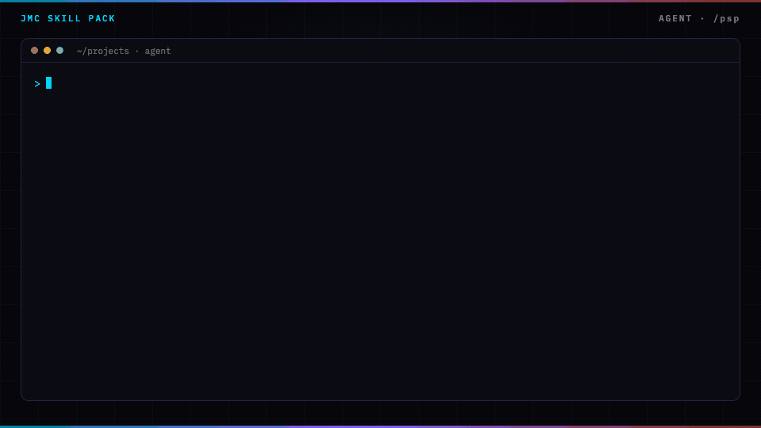

<p align="center">
  
</p>

# claude-psp

> Replace a $15K-30K positioning consultant — the Pain Signal Profile
> framework, as a Claude Code skill pack.

Translates **public signals** (job posts, funding, hires, launches)
into the **felt operational pain** that drives B2B buying. Outputs a
structured PSP doc with 5 components + a recommended signal-hunt
stack + the 8-12 vocabulary phrases your outreach must use verbatim.

Based on the **[JMC Pain Signal Profiles](https://jaymountconsulting.com/learn/courses/pain-signal-profiles)**
course. No LLM calls inside the skill — pure framework + deterministic
scoring.

[](LICENSE)
[](https://github.com/cmj-hub/claude-psp)


<p align="center">
  
</p>


## What it does

```mermaid
graph LR
    A["/psp"] --> B{Kickoff: state check}
    B -->|First time| C[Onboarding<br/>brand-config + SOUL]
    B -->|Have config| D[Construct PSP / Signal Hunt]
    C --> D
    D --> E[Score PSP<br/>script]
    E -->|≥70| F[Push to claude-evp + claude-cold-email]
    E -->|<70| D

    style C fill:#1a1a2e,stroke:#00d4ff
    style E fill:#1a1a2e,stroke:#cc4714
```



## The 4 sub-skills

| Sub-skill | What it does |
|---|---|
| `psp-kickoff` | Adaptive router — detects state (brand-config? primary PSP drafted? vocabulary mined?) and picks the next step |
| `psp-onboarding` | 15-min interactive setup → writes brand-config.json + SOUL.md |
| `psp-construct` | Walk operator through 5-component PSP construction (signal → pain → timing → role → vocabulary) |
| `psp-signal-hunt` | Surface 5-10 public signals worth hunting for the ICP + operational signal-source stack |

## The deterministic script

| Script | Job |
|---|---|
| `scripts/score_psp.py` | Score any PSP draft 0-100 across 5 axes (signal specificity, pain specificity, timing anchor, role precision, vocabulary specificity). Catches abstract jargon, demographic-as-signal mistakes, missing recency anchors, C-level-vs-felt-pain confusion. |

Calibrated: strong PSP scores 100/100; an abstract "B2B SaaS company that needs to scale growth" scores 32/100 with specific flags per axis.

## The 3-tier config (operator owns)

```
brand-config.json   ← ICP precision + PSP drafts + signal sources + cadence
SOUL.md             ← Operator's stories, vocabulary, the 11am-Tuesday moment
AGENTS.md           ← Behavior rules (refuse abstract pain, no fabricated signals, etc.)
```

The skill **refuses to generate a PSP without brand-config + SOUL** —
generic PSP is worse than no PSP.

## Install

### Claude Code

```bash
/plugin marketplace add cmj-hub/claude-psp
/plugin install psp
```

### One-line install

```bash
curl -fsSL https://raw.githubusercontent.com/cmj-hub/claude-psp/main/install.sh | bash
```

## First run

```
> /psp

Welcome. Let's figure out where you are.

[Detected: brand-config.json missing]

You're at step 1 of 6:
1. ⬜ Onboarding — capture ICP + 1 primary PSP draft (15 min)   ← YOU ARE HERE
2. ⬜ Mine 8+ vocabulary phrases from real buyer writing
3. ⬜ Pick signal sources + cadence
4. ⬜ Run first signal hunt → 5-10 candidates
5. ⬜ Build secondary PSP for next-priority segment
6. ⬜ Plug into claude-evp + claude-cold-email downstream

Step 1 takes ~15 minutes. Ready? (y/n)
```

## The framework

```
Signal      →  Pain          →  Timing       →  Role          →  Vocabulary
(verifiable    (operational    (why now is    (who feels it    (their words,
 thing they    consequence)    acute)          most)            not yours)
 did)
```

5 components. If you can't fill in all five, you don't have a PSP yet
— you have demographics or guesses.

## Cost arbitrage — what this replaces

| Role | $ range | What you'd outsource |
|---|---|---|
| Positioning consultant | $15K-30K per engagement | One PSP segment, 2-4 weeks |
| Market research consultant | $20K-50K per project | Per-segment buyer-pain mapping |
| ICP-refinement workshop | $5K-15K | One-time facilitation |

This skill pack + the JMC PSP framework can produce the PSP in ~15
minutes of structured input + ongoing weekly refinement. It does NOT
replace the act of TALKING to real buyers — but it gives you the
scaffold to capture what you hear so it's operational.

## Plugs into

- **[cmj-hub/claude-evp](https://github.com/cmj-hub/claude-evp)** — your EVP must speak to the PSP pain in their vocabulary
- **[cmj-hub/claude-cold-email](https://github.com/cmj-hub/claude-cold-email)** — every cold email opener anchors on a PSP signal
- **[cmj-hub/claude-founder-brand](https://github.com/cmj-hub/claude-founder-brand)** — Process pillar content often maps to PSP work

## Repo structure

```
claude-psp/
├── .claude-plugin/plugin.json
├── README.md
├── LICENSE
├── CHANGELOG.md
├── AGENTS.md                       ← Behavior rules
├── SOUL.md                         ← Operator vocabulary + stories template
├── brand-config.example.json       ← Brand config template
├── install.sh
├── psp/                            ← Main orchestrator
│   └── SKILL.md
├── skills/                         ← Sub-skills (progressive disclosure)
│   ├── psp-onboarding/SKILL.md
│   ├── psp-kickoff/SKILL.md
│   ├── psp-construct/SKILL.md
│   └── psp-signal-hunt/SKILL.md
└── scripts/
    └── score_psp.py
```

## Course

This skill is the agent-form of the **Pain Signal Profiles** course.

→ [jaymountconsulting.com/learn/courses/pain-signal-profiles](https://jaymountconsulting.com/learn/courses/pain-signal-profiles)

Want it all-access? **[Operator Pass](https://jaymountconsulting.com/operator-pass)**.

## License

MIT. Built by [Jay Mount Consulting](https://jaymountconsulting.com).
