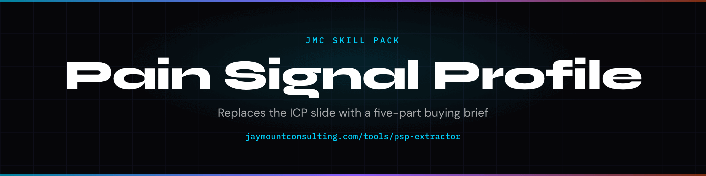

<p align="center">
  
</p>

# claude-psp

> Your ICP describes a costume. A Pain Signal Profile describes Tuesday at 11am.

A Pain Signal Profile is a five-part buying brief: a public signal, the operational pain it implies, why that pain is acute now, who feels it at 11am on Tuesday, and the exact phrases that person uses. It replaces a static ICP.

You already know the costume. Series B. VP of Marketing. Fifty employees. You can write that slide in your sleep. It does not tell you who to email on Thursday.

A Demand Gen Lead job post, four days ago, does. That is a thing they did. The PSP names what that post does to the person who feels the pipeline gap at 11am, and the words they use when they talk about it.

We scored both samples in this repo. The costume scored **37**. The signal scored **100**. The Python that did that is in `scripts/score_psp.py`. No LLM. No paid API.

The build guide teaches the framework to a human. This pack teaches the same framework to an agent.

[](LICENSE)
[](https://github.com/cmj-hub/claude-psp)
[](https://skills.sh/cmj-hub/claude-psp)


<p align="center">
  
</p>

## What this replaces

A static ICP deck. A $15K positioning sprint's first week. The slide that says "our buyer is a VP" and then wonders why outbound is quiet.

## Install

Two commands. Works in Claude Code, Cursor, Codex, Grok, Copilot, Windsurf, Cline, OpenCode, and the rest of the [skills CLI](https://skills.sh) list.

```bash
npx skills add cmj-hub/claude-psp --all -g --full-depth
```

```text
/plugin marketplace add cmj-hub/gtm-operator-skills
/plugin install psp
```

Also: `npm install github:cmj-hub/claude-psp` then `npx jmc-psp`. Or `curl -fsSL https://raw.githubusercontent.com/cmj-hub/claude-psp/main/install.sh | bash`.

## What you walk out with in 15 minutes

Artifact: `examples/good.json` versus `examples/bad.json`.

```bash
python3 scripts/score_psp.py --file examples/good.json
python3 scripts/score_psp.py --file examples/bad.json
```

Score the sample. Then write yours. One loop. One ICP. Example data. That is the whole first run.

## What this pack will not do

It will not hunt LinkedIn for you. It will not pick this quarter's PSP. It will not ingest your CRM.

This pack drafts and scores. It will not pick this quarter's PSP, ingest your CRM, or update when Gmail changes the spam window. Those are judgement calls and live data. This pack gives you the instrument and the rubric; you bring the account.

## How is a Pain Signal Profile different from an ICP?

An ICP names who they are — stage, title, headcount. A Pain Signal Profile names what they just did, what that does to their Tuesday, why it is acute now, who feels it, and the phrases they actually use.

State is not a signal. A job post four days ago is. If you cannot fill all five parts, you do not have a PSP yet.

## Do I need live data to start?

No. The Series-B sample is in `examples/`. Score it. Then swap in a signal from your book. Live hunt is not the first loop.

## Does this hunt signals for me?

No. After the sample, `signal-hunt` names the *kinds* of public signals worth watching — job posts, funding, launches, hires. It does not log in. Closed-loop hunt on live accounts is out of scope here.

## Free, no signup

- **[Pain Signal Profile Extractor](https://jaymountconsulting.com/tools/psp-extractor)** — the same job as this pack, hosted. No account, no key.
- [Pain Signal Profiles framework](https://jaymountconsulting.com/frameworks/pain-signal-profiles)
- [Pain Signal Playbook](https://jaymountconsulting.com/pain-signal-playbook)

## Free, by email

[**Foundation Scorecard**](https://jaymountconsulting.com/foundation-scorecard) — 14 checkpoints on the targeting layer under your GTM, plus a 90-minute prioritization guide.

That one does ask for an email, and it enrols you in a short follow-up on the same topic. Unsubscribe whenever.

[**The Friday Signal**](https://jaymountconsulting.com/newsletter/signal) — one free edition a week on building GTM systems that compound. No pitch in it.


## Companion packs

- [claude-evp](https://github.com/cmj-hub/claude-evp) — 22-word Early Value Proposition per Schwartz tier
- [claude-cold-email](https://github.com/cmj-hub/claude-cold-email) — signal, pain, EVP, binary ask
- [claude-founder-brand](https://github.com/cmj-hub/claude-founder-brand) — Pillar / Proof / Process / Person
- [claude-pricing](https://github.com/cmj-hub/claude-pricing) — three-tier contrast and pocket-price leaks

## License

MIT. See [LICENSE](./LICENSE).

## About

Built by [Jay Mount Consulting](https://jaymountconsulting.com).

## Regenerating the artwork

`assets/social-preview.png` and `assets/header.png` are generated from `assets/spec.json` by a vendored renderer — no CI, no shared workflow, no network beyond the webfonts:

```bash
node assets/card.mjs assets/spec.json assets/          # social-preview.png + header.png
npm i playwright-core && node assets/demo.mjs assets/spec.json assets/demo.gif
```
