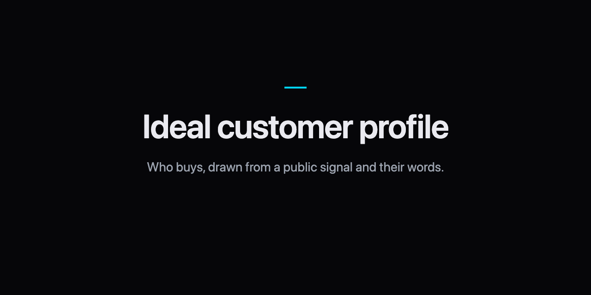
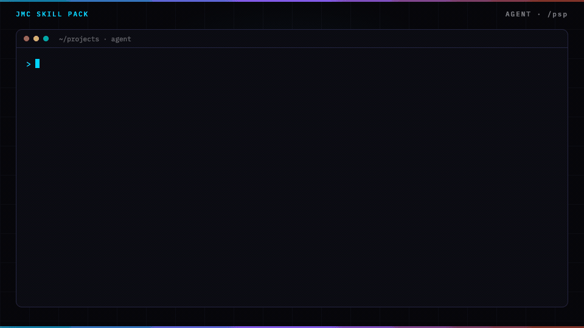

<p align="center">
  
</p>

# Ideal customer profile skill for Claude Code

An ideal customer profile is who buys, drawn from a public signal and the words they use on a real day, not a costume persona.

## In 60 seconds

```text
/plugin marketplace add cmj-hub/gtm-operator-skills
/plugin install psp@gtm-operator-skills
/psp:psp
```

Or score the sample without an agent:

```bash
python3 scripts/score_psp.py --file examples/good.json   # exit 0, prints the pain brief and "Next: /evp:evp"
python3 scripts/score_psp.py --file examples/bad.json    # exit 1: - score 37/100 is under 70 → work through the axis lines below, lowest axis first
```

Part of the GTM operator suite — `/plugin install gtm@gtm-operator-skills` installs all ten.

Add the [gtm-operator mod](https://github.com/cmj-hub/gtm-operator-claude-mod) to see the suite's next step above your prompt and keep `brand-config.json` from being overwritten: `/plugin install gtm-operator@gtm-operator-skills`.

> Your ICP describes a costume. A Pain Signal Profile describes Tuesday at 11am.

A Pain Signal Profile is a five-part buying brief: a public signal, the operational pain it implies, why that pain is acute now, who feels it at 11am on Tuesday, and the exact phrases that person uses. It replaces a static ICP.

You already know the costume. Series B. VP of Marketing. Fifty employees. You can write that slide in your sleep. It does not tell you who to email on Thursday.

A Demand Gen Lead job post, four days ago, does. That is a thing they did. The PSP names what that post does to the person who feels the pipeline gap at 11am, and the words they use when they talk about it.

We scored both samples in this repo. The costume scored **37**. The signal scored **100**. The Python that did that is in `scripts/score_psp.py`. No LLM. No paid API.

The build guide teaches a human. The pack teaches an agent.

<p align="center">
  
</p>

## What's in the pack

One skill, `psp`, with modes. Type `/psp:psp` and a mode, or just ask.

| Mode | Job |
|---|---|
| `status` (no argument) | Reads where you are and names the next step. |
| `setup` | 15-minute setup: merges your PSP draft and signal sources into `brand-config.json` + `SOUL.md`. Shared operator/ICP questions come from `/gtm:setup` once for the suite. |
| `construct` | Builds one PSP, all five parts, saves it to `gtm/psp.md`, then scores it. |
| `signal-hunt` | Lists 5-10 public signals worth watching for a segment, with source and cadence. |
| `validate` | Scores a draft with `scripts/score_psp.py`. |

Moved in 0.6: the sub-skills `psp-kickoff`, `psp-onboarding`, `psp-construct` and `psp-signal-hunt` are now the modes above (`/psp:psp status`, `setup`, `construct`, `signal-hunt`).

`scripts/score_psp.py` exits 0 when a PSP is operational: 70 or more, the signal is no older than 30 days, and the pain uses one of the buyer's own phrases. A 95 built on a 45-day-old job post still exits 1. So does a persona table.

## What this replaces

A static ICP deck. A $15K positioning sprint's first week. The slide that says "our buyer is a VP" and then wonders why outbound is quiet.

## Install

```text
npx skills add cmj-hub/claude-psp --all -g --full-depth
```

`--all` writes this pack for every host the installer knows. One host:

```text
npx skills add cmj-hub/claude-psp --skill '*' -g --full-depth -y -a claude-code
```

Swap `claude-code` for `cursor`, `codex`, `grok`, `github-copilot`, `windsurf`, `cline`, or `opencode`.

Claude Code: see [In 60 seconds](#in-60-seconds).

## What you walk out with in 15 minutes

Artifact: `examples/good.json` versus `examples/bad.json`.

```bash
python3 scripts/score_psp.py --file examples/good.json
python3 scripts/score_psp.py --file examples/bad.json
python3 scripts/score_psp.py --file examples/persona.json
```

`examples/good.json` prints a pain brief: the pain sentence, and the buyer phrase inside it. `examples/persona.json` is a persona table. It exits 1: `persona has no pain in the buyer's language`. Every exit-1 reason prints as `- what is wrong → what to change`; add `--json` for one JSON object with `reasons`, `fixes` and `next`.

It also reads the markdown doc the `construct` mode writes (`gtm/psp.md`), and the draft inside your config:

```bash
python3 scripts/score_psp.py --file brand-config.json --json-path psp_drafts.primary
python3 scripts/score_psp.py --file brand-config.json --json-path psp
```

Score the sample. Then write yours. One loop. One ICP. Example data. That is the whole first run.

## What this pack will not do

It will not hunt LinkedIn for you. It will not pick this quarter's PSP. It will not ingest your CRM.

This pack drafts and scores. It will not pick this quarter's PSP, ingest your CRM, or update when Gmail changes the spam window. Those are judgement calls and live data. This pack gives you the instrument and the rubric; you bring the account.

## The data step this pack leaves to you

This pack scores the Pain Signal Profile. Building the company list that shows the signal is a separate job.

Run [Build a company list](https://thegtmdirectory.com/jobs/build-a-company-list) on The GTM Directory — tools that pull companies matching your filters so you can swap the sample for your book.

## How is a Pain Signal Profile different from an ICP?

An ICP names who they are — stage, title, headcount. A Pain Signal Profile names what they just did, what that does to their Tuesday, why it is acute now, who feels it, and the phrases they actually use.

State is not a signal. A job post four days ago is. If you cannot fill all five parts, you do not have a PSP yet.

## Do I need live data to start?

No. The Series-B sample is in `examples/`. Score it. Then swap in a signal from your book. Live hunt is not the first loop.

## Does this hunt signals for me?

No. After the sample, `/psp:psp signal-hunt` names the *kinds* of public signals worth watching — job posts, funding, launches, hires. It does not log in. Closed-loop hunt on live accounts is out of scope here.

## On the site

- [Pain Signal Profiles pack](https://jaymountconsulting.com/skills/claude-psp) — this pack's page
- [Skill packs catalog](https://jaymountconsulting.com/skills) — install paths + every pack
- [Course twin](https://jaymountconsulting.com/learn/courses/pain-signal-profiles) — human build guide for this pack

## Free, no signup

- **[Pain Signal Profile Extractor](https://jaymountconsulting.com/tools/psp-extractor)** — the same job as this pack, hosted. No account, no key.
- [Pain Signal Profiles framework](https://jaymountconsulting.com/frameworks/pain-signal-profiles)
- [Pain Signal Playbook](https://jaymountconsulting.com/pain-signal-playbook)

## Free, by email

[**Growth Audit**](https://jaymountconsulting.com/growth-audit) — where your go-to-market stack is leaking, sent to your inbox.

That one does ask for an email, and it enrols you in a short follow-up on the same topic. Unsubscribe whenever.

[**The Friday Signal**](https://jaymountconsulting.com/newsletter/signal) — one free edition a week on building GTM systems that compound. No pitch in it.


## Next

[Value proposition](https://github.com/cmj-hub/claude-evp)

## Privacy and security

The scorer is stdlib Python and runs locally. No script opens a network connection. The skills may use WebFetch to read a public page, only when you ask for one. The pack writes `brand-config.json` and `SOUL.md` in your project root and `gtm/psp.md`, and nothing else. No telemetry, no credentials, nothing sent or posted. See [SECURITY.md](SECURITY.md).

## License

MIT. See [LICENSE](./LICENSE).

## About

Built by [Jay Mount Consulting](https://jaymountconsulting.com).
